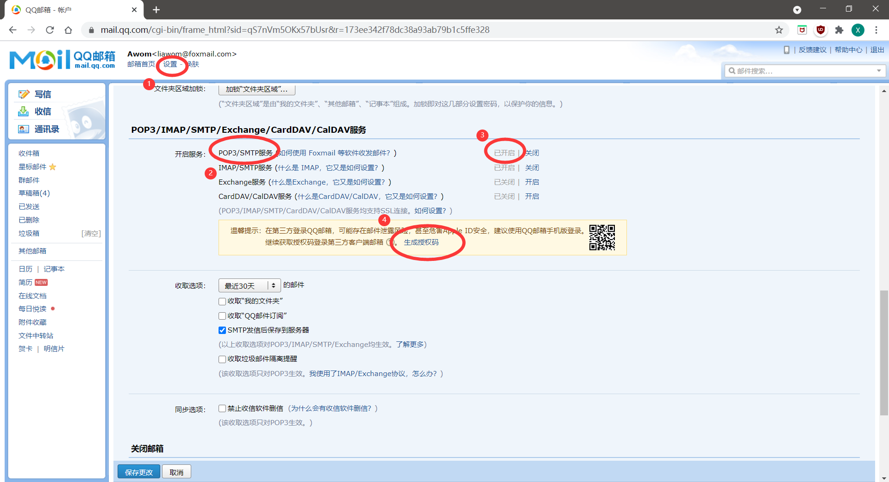

## 1. 简单的介绍

这是一个自动通过QQ邮箱发送天气预报的程序。发送的时间，目标均可以自己设置。

这个是大二的时候，自己随便写着玩玩的，也没啥技术含量甚至比较菜，挂上来好玩吧哈哈哈哈

## 2. 大概怎么用

### 2.1 设置QQ邮箱

首先需要先设置你的QQ邮箱，**开启SMTP**服务。大概的开启方式如图所示

### 2.2 配置 information.json

文件目录下有一个`information.json`文件，只需要把生成的授权码，发送人，接收人等一系列信息填入到json文件中即可。

json文件中的 `"time"` 是发送邮件的时间。设置`hour`以及`min`可以在固定的时间自动发送邮件到相应的目标

## 3. 如何启动

1. 直接运行`main.py`文件即可启动

2. 在Linux服务器上cd到相应目录，运行 `nohup python main.py &` 即可